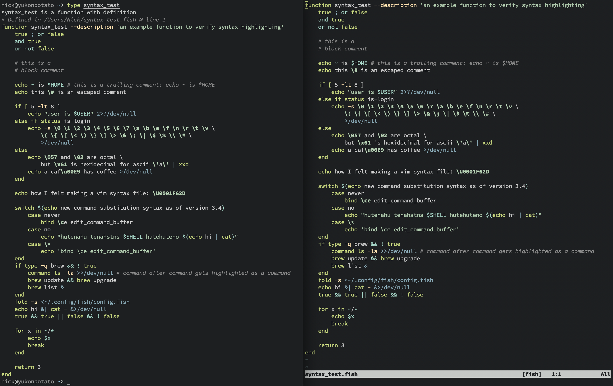

# fish.vim

This is a Vim/Neovim plugin that provides Fish syntax highlighting, automatic indentation as you type, file detection, and a colorscheme matching Fish's default shell highlighting.

The syntax highlighting is very close to how fish highlights text in an interactive shell.  Try comparing `type fish_prompt` and `funced --editor=vim fish_prompt` (or `--editor=nvim` if you use Neovim).  They should be exactly the same or very similar, assuming your fish and vim colors match.

#### Example (left is a shell, right is vim):



Please open an issue if you encounter differences in highlighting.

---

### Install with [vim-plug](https://github.com/junegunn/vim-plug)
```vim
Plug 'nickeb96/fish.vim'
```

It should also work with other plugin managers.

---

### Fish Default Colorscheme

Use `:colorscheme fish-default` to have the editor use the same colors that Fish uses by default.  This colorscheme only works with fish files, so use a conditional autocommand in your config file to set it:

```vim
autocommand FileType fish colorscheme fish-default
```

:warning: Fish's default shell colors only use the basic 16 terminal colors.  These are set by the terminal emulator and the exact RGB values can't be determined by programs running inside of it.  This means that if you have Vim/Neovim running in GUI mode, the colors won't exactly match what you see in a shell.  You'll instead get colors from the Tomorrow Night theme, which I've set as a fallback.

You can use `autocommand FileType fish set notermguicolors` to force Vim/Neovim to use the basic 16 colors that fish uses by default when editing \*.fish files.

---

### Custom Colorscheme

This plugin creates syntax highlighting groups that match [Fish's `$fish_color_*` variables](https://fishshell.com/docs/current/interactive.html?highlight=color%20variables#variables-color).  You can create a custom colorscheme by setting vim highlight groups with the same name and value:

```shell
fish> echo $fish_color_option
8abeb7
```

and then

```vim
" inside your custom vim colorscheme
hi fish_color_option guifg=#8abeb7
```

Look inside [colors/fish-default.vim](./colors/fish-default.vim) for more examples.


## Future Plans

- Fix tilde being highlighted wrong in `cmd text~`
- Add support for new `VAR=val command` syntax
- Add support for folding and concealing
- Fix any remaining discrepancies in syntax highlighting
- Add auto-formatting support with `fish_indent`
- Possibly add completion support

